# Diagram Autentykacji - 10x-cards

## Przegląd

Diagram przedstawia przepływ autentykacji w aplikacji 10x-cards, obejmujący:
- Ochronę tras przez middleware
- Rejestrację i logowanie użytkowników
- Generowanie fiszek z autentykacją
- Wylogowanie
- Resetowanie hasła
- Odświeżanie tokenów

## Diagram Sekwencji

```mermaid
sequenceDiagram
autonumber
participant B as Przeglądarka (UI)
participant M as Middleware (SSR)
participant A as Astro API (Auth/Generations)
participant S as Supabase Auth

%% Ochrona tras
B->>M: Żądanie strony chronionej /generate (SSR)
M->>S: Weryfikacja/odświeżenie sesji z cookie
alt Sesja ważna
  S-->>M: OK (session + user)
  M-->>B: 200 + HTML (zawartość strony)
else Sesja nieważna/wygaśnięta
  S-->>M: Brak/expired
  M-->>B: 302 Redirect do /auth/login
end

%% Rejestracja (auto-logowanie)
B->>A: POST /api/auth/register (email, hasło, confirm)
A->>A: Walidacja danych (Zod schema)
A->>S: signUp (email/password provider)
alt Email już istnieje
  S-->>A: 409 Conflict
  A-->>B: 409 + komunikat (email zajęty)
else Rejestracja pomyślna
  S-->>A: user utworzony
  A->>S: signInWithPassword (auto-login)
  S-->>A: session (access, refresh)
  A-->>B: 201 + Set-Cookie (session) + success
  B->>M: GET /generate (po sukcesie rejestracji)
  M->>S: Weryfikacja sesji z cookie
  S-->>M: OK (session)
  M-->>B: 200 + Strona generowania fiszek
end

%% Logowanie
B->>A: POST /api/auth/login (email, hasło, rememberMe)
A->>A: Walidacja danych (Zod schema)
A->>S: signInWithPassword
alt Dane poprawne
  S-->>A: session (access, refresh)
  A-->>B: 200 + Set-Cookie (30 dni jeśli rememberMe)
  B->>M: GET /generate
  M->>S: Weryfikacja sesji
  S-->>M: OK (session + user)
  M-->>B: 200 + Strona generowania fiszek
else Dane błędne
  S-->>A: 401 Unauthorized
  A-->>B: 401 + neutralny komunikat
end

%% Generowanie fiszek (chronione)
B->>A: POST /api/generations (source_text)
A->>A: Sprawdzenie user_id z context.locals
alt Brak autentykacji
  A-->>B: 401 Unauthorized
else Użytkownik zalogowany
  A->>A: Walidacja source_text (1000-10000 znaków)
  A->>A: GenerationService + OpenRouter API
  Note over A: Generowanie propozycji fiszek przez AI
  A->>A: Zapis generations z user_id
  A-->>B: 201 + generation_id + flashcards_proposals
  B->>B: Wyświetlenie propozycji do akceptacji
end

%% Zapisywanie zaakceptowanych fiszek
B->>A: POST /api/flashcards (flashcards[])
A->>A: Sprawdzenie user_id z context.locals
A->>A: Walidacja danych (Zod schema)
A->>A: FlashcardService.createFlashcards
A->>A: Zapis flashcards z user_id
A-->>B: 201 + created flashcards
Note over B: Fiszki zapisane dla użytkownika

%% Wylogowanie
B->>A: POST /api/auth/logout
A->>S: signOut / revoke session
S-->>A: OK
A-->>B: 200 + Clear-Cookie (usunięcie session)
B->>M: GET /auth/login
M-->>B: 200 + Strona logowania

%% Zapomniane hasło
B->>A: POST /api/auth/forgot-password (email)
A->>A: Walidacja email
A->>S: resetPasswordForEmail
S-->>A: OK
S->>B: Email z linkiem /auth/reset-password?token=xxx
A-->>B: 200 + komunikat (sprawdź email)
Note over B,S: Link wysłany, nie ujawnia czy email istnieje

%% Resetowanie hasła
B->>A: POST /api/auth/reset-password (token, password)
A->>A: Walidacja hasła (min 8 znaków, siła)
A->>S: Weryfikacja tokenu + updateUser
alt Token ważny
  S-->>A: OK (hasło zmienione)
  A-->>B: 200 + success
  B->>M: GET /auth/login
  M-->>B: 200 + komunikat (zaloguj się nowym hasłem)
else Token wygasł/nieprawidłowy
  S-->>A: 401 Token expired
  A-->>B: 401 + komunikat o wygaśnięciu
end

%% Odświeżenie tokenu podczas użycia
B->>A: Żądanie API chronione (po dłuższym czasie)
A->>S: Weryfikacja/refresh tokenu
alt Refresh udany
  S-->>A: Nowa sesja (access token)
  A-->>B: 200 + Set-Cookie (odświeżone)
else Refresh nieudany
  S-->>A: Refresh token wygasł
  A-->>B: 401 + redirect to /auth/login
end
```

## Kluczowe Przepływy

### 1. Ochrona Tras (Middleware)
- Każde żądanie strony chronionej przechodzi przez middleware
- Middleware weryfikuje sesję z cookie w Supabase Auth
- Brak lub wygaśnięta sesja → redirect do `/auth/login`

### 2. Rejestracja z Auto-Logowaniem
- Walidacja danych wejściowych (Zod schema)
- Utworzenie konta w Supabase Auth
- Automatyczne logowanie po rejestracji
- Ustawienie secure cookie z sesją

### 3. Logowanie
- Walidacja email i hasła
- Opcja "Zapamiętaj mnie" (cookie na 30 dni)
- Neutralne komunikaty błędów (bezpieczeństwo)
- Przekierowanie do `/generate` po sukcesie

### 4. Generowanie i Zapisywanie Fiszek
- Wymaga autentykacji (sprawdzenie `user_id` z `context.locals`)
- Walidacja tekstu źródłowego (1000-10000 znaków)
- Generowanie propozycji przez OpenRouter API
- Zapis z `user_id` dla izolacji danych użytkownika

### 5. Wylogowanie
- Anulowanie sesji w Supabase Auth
- Czyszczenie cookie
- Przekierowanie do strony logowania

### 6. Reset Hasła
- Żądanie linku resetowania (nie ujawnia czy email istnieje)
- Email z tokenem resetowania
- Walidacja nowego hasła (min 8 znaków, wymagania siły)
- Weryfikacja tokenu przed zmianą hasła

### 7. Odświeżanie Tokenu
- Automatyczne odświeżanie przed wygaśnięciem
- Wygaśnięty refresh token → wylogowanie

## Bezpieczeństwo

- **Secure HttpOnly cookies** - ochrona przed XSS
- **Izolacja danych** - `user_id` z sesji dla każdej operacji
- **Walidacja danych** - schematy Zod dla wszystkich endpointów
- **Neutralne komunikaty** - nie ujawniają szczegółów technicznych
- **SameSite: Strict** - ochrona przed CSRF
- **Weryfikacja sesji** - przy każdym żądaniu przez middleware

## Technologie

- **Frontend**: React 19 + Astro 5
- **Autentykacja**: Supabase Auth (Email/Password)
- **Walidacja**: Zod
- **AI**: OpenRouter API (gpt-4o-mini)
- **Baza danych**: Supabase PostgreSQL

## Istniejące Komponenty w Codebase

### Middleware
- `src/middleware/index.ts` - obecnie dodaje tylko Supabase client do context.locals
- **Wymaga rozszerzenia**: dodanie logiki weryfikacji sesji i ochrony tras

### API Endpoints (istniejące)
- `src/pages/api/generations.ts` - generowanie fiszek przez AI
- `src/pages/api/flashcards.ts` - zapis fiszek do bazy
- **Wymaga modyfikacji**: dodanie sprawdzania `user_id` z sesji

### Serwisy
- `src/lib/generation.service.ts` - GenerationService z integracją OpenRouter
- `src/lib/flashcard.service.ts` - FlashcardService do operacji na fiszkach
- **Obecnie używają**: `DEFAULT_USER_ID` - wymaga zamiany na prawdziwe `user_id`

### Komponenty React
- `src/components/FlashcardGenerationView.tsx` - główny widok generowania
- `src/components/hooks/useGenerateFlashcards.ts` - hook do komunikacji z API
- `src/components/FlashcardList.tsx` - lista propozycji fiszek
- `src/components/BulkSaveButton.tsx` - zapis zaakceptowanych fiszek

### Database Client
- `src/db/supabase.client.ts` - klient Supabase
- `src/env.d.ts` - typy dla context.locals (wymaga rozszerzenia o session i user)

## Zgodność z Dokumentacją

Diagram został utworzony zgodnie z:
- `.ai/prd.md` - Dokument wymagań produktu (US-001, US-002, US-003, US-009)
- `.ai/auth-spec.md` - Specyfikacja architektury modułu autentykacji
- Istniejąca funkcjonalność generowania fiszek
- Wymagania bezpieczeństwa (RODO, ochrona danych)

## Zmiany Wymagane w Codebase

### Nowe Pliki
1. **Komponenty React**:
   - `src/components/LoginForm.tsx`
   - `src/components/RegisterForm.tsx`
   - `src/components/ForgotPasswordForm.tsx`
   - `src/components/ResetPasswordForm.tsx`
   - `src/components/AuthHeader.tsx`

2. **Strony Astro**:
   - `src/pages/auth/login.astro`
   - `src/pages/auth/register.astro`
   - `src/pages/auth/forgot-password.astro`
   - `src/pages/auth/reset-password.astro`

3. **API Endpoints**:
   - `src/pages/api/auth/register.ts`
   - `src/pages/api/auth/login.ts`
   - `src/pages/api/auth/logout.ts`
   - `src/pages/api/auth/forgot-password.ts`
   - `src/pages/api/auth/reset-password.ts`

4. **Serwisy i Biblioteki**:
   - `src/lib/auth.service.ts`
   - `src/lib/supabase.auth.ts`

### Modyfikacje Istniejących Plików
1. **Middleware**: `src/middleware/index.ts` - dodanie logiki sesji i ochrony tras
2. **Environment Types**: `src/env.d.ts` - dodanie `session` i `user` do `App.Locals`
3. **Validation**: `src/lib/validation.ts` - rozszerzenie o schematy autentykacji
4. **API Endpoints**: 
   - `src/pages/api/generations.ts` - dodanie `user_id` z sesji
   - `src/pages/api/flashcards.ts` - dodanie `user_id` z sesji
5. **Serwisy**:
   - `src/lib/generation.service.ts` - zamiana `DEFAULT_USER_ID` na parametr
   - `src/lib/flashcard.service.ts` - zamiana `DEFAULT_USER_ID` na parametr
6. **Database Client**: `src/db/supabase.client.ts` - usunięcie `DEFAULT_USER_ID`

### Migracje Bazy Danych
1. Dodanie kolumny `user_id` do tabeli `generations`
2. Dodanie kolumny `user_id` do tabeli `flashcards`
3. Dodanie foreign key constraints do `auth.users(id)`
4. Dodanie indeksów na `user_id` dla wydajności
