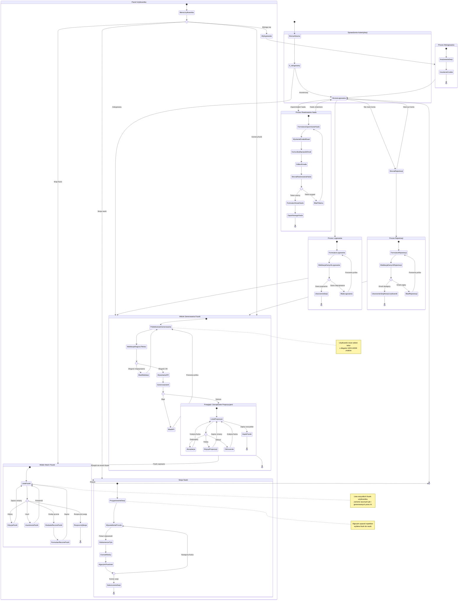

# Diagram Podróży Użytkownika - Moduł Autentykacji i Główne Funkcjonalności

## Przegląd

Ten diagram przedstawia kompleksową podróż użytkownika w aplikacji 10x-cards, uwzględniając:

- **Proces autentykacji** - rejestracja, logowanie, wylogowanie, reset hasła
- **Generowanie fiszek** - główna funkcjonalność aplikacji z wykorzystaniem AI
- **Zarządzanie fiszkami** - edycja, usuwanie, dodawanie ręczne
- **Sesja nauki** - wykorzystanie algorytmu spaced repetition
- **Punkty decyzyjne** - rozgałęzienia w zależności od stanu użytkownika i walidacji

## Główne Ścieżki Użytkownika

### 1. Nowy Użytkownik (Onboarding)
Użytkownik odwiedza aplikację po raz pierwszy → Przekierowanie na logowanie → Przejście do rejestracji → Rejestracja → Automatyczne logowanie → Widok generowania fiszek

### 2. Istniejący Użytkownik (Logowanie)
Użytkownik odwiedza aplikację → Logowanie → Widok generowania fiszek

### 3. Generowanie Fiszek
Wprowadzenie tekstu → Walidacja → Wywołanie AI → Przegląd propozycji → Akceptacja/Edycja → Zapis do bazy

### 4. Zarządzanie Fiszkami
Moje fiszki → Przeglądanie → Edycja/Usuwanie/Dodawanie ręczne → Powrót do listy

### 5. Sesja Nauki
Start sesji → Wyświetlenie fiszki (przód) → Odsłonięcie odpowiedzi → Ocena → Algorytm → Następna fiszka

### 6. Reset Hasła
Logowanie → "Zapomniałem hasła" → Email → Link → Nowe hasło → Logowanie

### 7. Wylogowanie
Menu użytkownika → Wylogowanie → Anulowanie sesji → Powrót do logowania

## Diagram

## Kluczowe Punkty Decyzyjne

### 1. Czy użytkownik zalogowany?
- **TAK** → Dostęp do chronionych stron (generate, my-flashcards)
- **NIE** → Przekierowanie na /auth/login

### 2. Czy ma już konto?
- **TAK** → Formularz logowania
- **NIE** → Formularz rejestracji

### 3. Czy dane logowania poprawne?
- **TAK** → Sesja utworzona, przekierowanie do /generate
- **NIE** → Błąd, ponowna próba

### 4. Czy tekst spełnia wymagania (1000-10000 znaków)?
- **TAK** → Wywołanie API do generowania
- **NIE** → Komunikat walidacji

### 5. Czy API zwróciło propozycje?
- **TAK** → Wyświetlenie listy propozycji
- **NIE** → Błąd, komunikat użytkownikowi

### 6. Co użytkownik chce zrobić z fiszką?
- **Zaakceptować** → Dodanie do listy akceptowanych
- **Edytować** → Otwarcie formularza edycji
- **Odrzucić** → Usunięcie z listy propozycji

### 7. Czy token resetu hasła ważny?
- **TAK** → Formularz nowego hasła
- **NIE** → Komunikat o wygaśnięciu, ponowny request

## Mapowanie na Historyjki Użytkownika (PRD)

| Historyjka | Stan/Proces w Diagramie |
|------------|-------------------------|
| US-001: Rejestracja konta | `ProcesRejestracji` |
| US-002: Logowanie do aplikacji | `ProcesLogowania` |
| US-003: Generowanie fiszek przy użyciu AI | `WidokGenerowania` → `GenerowanieAI` |
| US-004: Przegląd i zatwierdzanie propozycji fiszek | `PrzegladPropozycji` |
| US-005: Edycja fiszek | `EdycjaFiszki` (w `MojeFiszki`) |
| US-006: Usuwanie fiszek | `UsuniencieFiszki` (w `MojeFiszki`) |
| US-007: Ręczne tworzenie fiszek | `DodanieReczneFiszki` → `FormularzReczneFiszki` |
| US-008: Sesja nauki z algorytmem powtórek | `SesjaNauki` |
| US-009: Bezpieczny dostęp i autoryzacja | `SprawdzenieSesji` (middleware) |

## Mapowanie na Scenariusze (auth-spec.md)

| Scenariusz | Ścieżka w Diagramie |
|------------|---------------------|
| Scenariusz 1: Nowy użytkownik – Rejestracja | `[*]` → `StronaGlowna` → `StronaLogowania` → `StronaRejestracji` → `ProcesRejestracji` → `WidokGenerowania` |
| Scenariusz 2: Istniejący użytkownik – Logowanie | `[*]` → `StronaGlowna` → `StronaLogowania` → `ProcesLogowania` → `WidokGenerowania` |
| Scenariusz 3: Zalogowany użytkownik – Generowanie fiszek | `WidokGenerowania` → `PoletekstoweGenerowania` → `WywolanieAPI` → `GenerowanieAI` → `PrzegladPropozycji` → `ZapisFiszek` → `MojeFiszki` |
| Scenariusz 4: Zapomniałem hasła | `StronaLogowania` → `ProcesResetowania` → `StronaLogowania` |
| Scenariusz 5: Wylogowanie | `PanelUzytkownika` → `Wylogowanie` → `ProcesWylogowania` → `StronaLogowania` → `[*]` |

## Elementy Techniczne Wspierające Journey

### Komponenty React (client-side)
- `LoginForm.tsx` - formularz logowania z walidacją
- `RegisterForm.tsx` - formularz rejestracji
- `ForgotPasswordForm.tsx` - żądanie resetu hasła
- `ResetPasswordForm.tsx` - formularz nowego hasła
- `FlashcardGenerationView.tsx` - główny widok generowania
- `TextInputArea.tsx` - pole tekstowe z walidacją
- `GenerateButton.tsx` - przycisk wywołujący API
- `FlashcardList.tsx` - lista propozycji
- `FlashcardListItem.tsx` - pojedyncza fiszka z akcjami
- `BulkSaveButton.tsx` - zapis zaakceptowanych fiszek
- `AuthHeader.tsx` - nagłówek z menu użytkownika

### Strony Astro (routing)
- `/` - strona główna z przekierowaniem
- `/auth/login` - strona logowania
- `/auth/register` - strona rejestracji
- `/auth/forgot-password` - zapomniałem hasła
- `/auth/reset-password` - resetowanie hasła (z tokenem)
- `/generate` - chroniona strona generowania fiszek
- `/my-flashcards` - chroniona strona z listą fiszek (przyszłościowa)

### API Endpoints
**Autentykacja:**
- `POST /api/auth/login`
- `POST /api/auth/register`
- `POST /api/auth/logout`
- `POST /api/auth/forgot-password`
- `POST /api/auth/reset-password`

**Fiszki:**
- `POST /api/generations` - generowanie propozycji
- `POST /api/flashcards` - zapis fiszek
- `GET /api/flashcards` - lista fiszek (przyszłościowe)
- `PUT /api/flashcards/{id}` - edycja fiszki (przyszłościowe)
- `DELETE /api/flashcards/{id}` - usunięcie fiszki (przyszłościowe)

### Middleware
- `src/middleware/index.ts` - sprawdzenie sesji, ochrona tras, umieszczenie `context.locals.session` i `context.locals.user`

## Uwagi Implementacyjne

1. **Ochrona Tras**: Middleware sprawdza sesję dla stron `/generate` i `/my-flashcards`
2. **Sesja**: Przechowywana w secure HttpOnly cookie, zarządzana przez Supabase Auth
3. **Walidacja**: Po stronie klienta (React) i serwera (Zod schemas)
4. **Błędy**: Obsługa z komunikatami w języku polskim, bez ujawniania szczegółów technicznych
5. **UX**: Loading states, komunikaty sukcesu, błędów inline
6. **Bezpieczeństwo**: HTTPS, secure cookies, rate limiting, CSRF protection

## Zgodność z PRD

Diagram journey pokrywa wszystkie wymagania funkcjonalne z PRD:
- ✅ Automatyczne generowanie fiszek (US-003, US-004)
- ✅ Ręczne tworzenie i zarządzanie fiszkami (US-005, US-006, US-007)
- ✅ Podstawowy system uwierzytelniania (US-001, US-002, US-009)
- ✅ Integracja z algorytmem powtórek (US-008)
- ✅ Przechowywanie i skalowalność (izolacja danych per user)
- ✅ Statystyki generowania (metadata w tabeli `generations`)

