# Diagram Architektury UI - Moduł Autentykacji i Generowania Fiszek

## Przegląd

Ten diagram przedstawia kompleksową architekturę interfejsu użytkownika aplikacji 10x-cards po wdrożeniu modułu autentykacji. Diagram wizualizuje:

- **Nowe komponenty** (zielone) - dodane w ramach modułu autentykacji
- **Zmodyfikowane komponenty** (żółte) - istniejące komponenty wymagające aktualizacji
- **Istniejące komponenty** (niebieskie) - komponenty bez zmian
- **Middleware** (pomarańczowe) - warstwa zabezpieczeń i zarządzania sesją

## Architektura

```mermaid
flowchart TD
    %% ===== WARSTWA LAYOUTU I MIDDLEWARE =====
    subgraph MW["🔒 Middleware & Routing"]
        direction TB
        MID["Middleware<br/>(index.ts)"]
        MID -->|"Wczytuje sesję"| SESS["context.locals.session"]
        MID -->|"Sprawdza uprawnienia"| PROT["Ochrona tras"]
    end

    %% ===== LAYOUT GŁÓWNY =====
    subgraph LAY["📐 Layout"]
        direction TB
        LAYOUT["Layout.astro<br/>(główny layout)"]
        LAYOUT -->|"Warunkowe renderowanie"| HEADER["AuthHeader"]
        LAYOUT -->|"Zawiera"| SLOT["slot (zawartość strony)"]
        LAYOUT -->|"Init theme"| THEME_INIT["Inline script<br/>(theme init)"]
    end

    %% ===== STRONY PUBLICZNE - AUTENTYKACJA =====
    subgraph AUTH_PAGES["🔓 Strony Autentykacji (publiczne)"]
        direction TB
        LOGIN_PAGE["auth/login.astro"]
        REGISTER_PAGE["auth/register.astro"]
        FORGOT_PAGE["auth/forgot-password.astro"]
        RESET_PAGE["auth/reset-password.astro"]

        LOGIN_PAGE -->|"Renderuje"| LOGIN_FORM["LoginForm.tsx"]
        REGISTER_PAGE -->|"Renderuje"| REGISTER_FORM["RegisterForm.tsx"]
        FORGOT_PAGE -->|"Renderuje"| FORGOT_FORM["ForgotPasswordForm.tsx"]
        RESET_PAGE -->|"Renderuje"| RESET_FORM["ResetPasswordForm.tsx"]
    end

    %% ===== STRONY CHRONIONE =====
    subgraph PROTECTED_PAGES["🔐 Strony Chronione (wymaga sesji)"]
        direction TB
        INDEX_PAGE["index.astro<br/>(ZMIENIONY)"]
        GENERATE_PAGE["generate.astro<br/>(ZMIENIONY)"]

        INDEX_PAGE -->|"Przekierowanie<br/>logic"| REDIR_LOGIC{{"Zalogowany?"}}
        REDIR_LOGIC -->|"Tak"| REDIR_GEN["/generate"]
        REDIR_LOGIC -->|"Nie"| REDIR_LOGIN["/auth/login"]

        GENERATE_PAGE -->|"Renderuje"| FLASHCARD_VIEW["FlashcardGenerationView"]
    end

    %% ===== KOMPONENTY FORMULARZY AUTH =====
    subgraph AUTH_FORMS["📝 Formularze Autentykacji (React)"]
        direction TB
        LOGIN_FORM
        REGISTER_FORM
        FORGOT_FORM
        RESET_FORM

        LOGIN_FORM -->|"POST"| API_LOGIN["API: /api/auth/login"]
        REGISTER_FORM -->|"POST"| API_REGISTER["API: /api/auth/register"]
        FORGOT_FORM -->|"POST"| API_FORGOT["API: /api/auth/forgot-password"]
        RESET_FORM -->|"POST"| API_RESET["API: /api/auth/reset-password"]
    end

    %% ===== NAWIGACJA =====
    subgraph NAV["🧭 Nawigacja"]
        direction TB
        HEADER -->|"Dla zalogowanych"| AUTH_MENU["Menu użytkownika<br/>(email, avatar, wyloguj)"]
        HEADER -->|"Dla anonimowych"| ANON_MENU["Przyciski<br/>(Zaloguj, Rejestracja)"]
        HEADER -->|"Zawiera"| THEME_TOGGLE["ThemeToggle"]

        AUTH_MENU -->|"Wyloguj → POST"| API_LOGOUT["API: /api/auth/logout"]
        THEME_TOGGLE -->|"Używa"| USE_THEME["useTheme hook"]
    end

    %% ===== WIDOK GENEROWANIA FISZEK =====
    subgraph FLASHCARD_GEN["🎯 Moduł Generowania Fiszek"]
        direction TB
        FLASHCARD_VIEW -->|"Zarządza stanem"| GEN_STATE["Stan: sourceText,<br/>localFlashcards"]
        FLASHCARD_VIEW -->|"Renderuje"| TEXT_INPUT["TextInputArea"]
        FLASHCARD_VIEW -->|"Renderuje"| GEN_BUTTON["GenerateButton"]
        FLASHCARD_VIEW -->|"Renderuje"| FLASHCARD_LIST["FlashcardList"]
        FLASHCARD_VIEW -->|"Renderuje"| BULK_SAVE["BulkSaveButton"]
        FLASHCARD_VIEW -->|"Renderuje"| ERROR_NOTIF["ErrorNotification"]
        FLASHCARD_VIEW -->|"Używa"| USE_GENERATE["useGenerateFlashcards hook"]

        TEXT_INPUT -->|"onChange"| GEN_STATE
        GEN_BUTTON -->|"onClick"| USE_GENERATE
        USE_GENERATE -->|"POST"| API_GENERATIONS["API: /api/generations<br/>(ZMIENIONY: +user_id)"]

        FLASHCARD_LIST -->|"Renderuje wiele"| FLASHCARD_ITEM["FlashcardListItem"]
        FLASHCARD_ITEM -->|"Akcje użytkownika"| ITEM_ACTIONS["Akceptuj / Edytuj / Odrzuć"]
        ITEM_ACTIONS -->|"Aktualizuje"| GEN_STATE

        BULK_SAVE -->|"POST"| API_FLASHCARDS["API: /api/flashcards<br/>(ZMIENIONY: +user_id)"]
    end

    %% ===== KOMPONENTY UI WSPÓŁDZIELONE =====
    subgraph UI_SHARED["🎨 Komponenty UI (shadcn/ui)"]
        direction LR
        UI_BUTTON["Button"]
        UI_CARD["Card / CardHeader /<br/>CardTitle / CardContent"]
        UI_AVATAR["Avatar"]
        SKELETON["SkeletonLoader"]
    end

    %% ===== API ENDPOINTS =====
    subgraph API["🔌 API Endpoints"]
        direction TB

        subgraph API_AUTH_GROUP["Autentykacja (NOWE)"]
            API_LOGIN
            API_REGISTER
            API_LOGOUT
            API_FORGOT
            API_RESET
        end

        subgraph API_FLASHCARD_GROUP["Fiszki (ZMODYFIKOWANE)"]
            API_GENERATIONS
            API_FLASHCARDS
        end

        API_AUTH_GROUP -->|"Integracja"| SUPABASE_AUTH["Supabase Auth"]
        API_FLASHCARD_GROUP -->|"Wymaga"| USER_SESSION["Session + user_id<br/>(z context.locals)"]
    end

    %% ===== POŁĄCZENIA MIDDLEWARE =====
    MW -.->|"Chroni"| PROTECTED_PAGES
    MW -.->|"Przekazuje sesję"| LAY
    MW -.->|"Przekazuje user_id"| API

    %% ===== POŁĄCZENIA LAYOUT =====
    LAY -.->|"Otacza"| AUTH_PAGES
    LAY -.->|"Otacza"| PROTECTED_PAGES

    %% ===== UŻYWANIE KOMPONENTÓW UI =====
    AUTH_FORMS -.->|"Używają"| UI_SHARED
    FLASHCARD_GEN -.->|"Używają"| UI_SHARED
    NAV -.->|"Używa"| UI_BUTTON

    %% ===== STYL WĘZŁÓW =====
    classDef newComponent fill:#86efac,stroke:#16a34a,stroke-width:3px,color:#000
    classDef modifiedComponent fill:#fde047,stroke:#ca8a04,stroke-width:3px,color:#000
    classDef existingComponent fill:#bfdbfe,stroke:#2563eb,stroke-width:2px,color:#000
    classDef apiEndpoint fill:#ddd6fe,stroke:#7c3aed,stroke-width:2px,color:#000
    classDef middleware fill:#fed7aa,stroke:#ea580c,stroke-width:3px,color:#000

    %% ===== PRZYPISANIE STYLÓW =====
    class LOGIN_FORM,REGISTER_FORM,FORGOT_FORM,RESET_FORM,HEADER newComponent
    class LOGIN_PAGE,REGISTER_PAGE,FORGOT_PAGE,RESET_PAGE newComponent
    class API_LOGIN,API_REGISTER,API_LOGOUT,API_FORGOT,API_RESET newComponent

    class INDEX_PAGE,GENERATE_PAGE,LAYOUT modifiedComponent
    class API_GENERATIONS,API_FLASHCARDS modifiedComponent

    class FLASHCARD_VIEW,TEXT_INPUT,GEN_BUTTON,FLASHCARD_LIST,FLASHCARD_ITEM existingComponent
    class BULK_SAVE,ERROR_NOTIF,SKELETON,THEME_TOGGLE existingComponent
    class UI_BUTTON,UI_CARD,UI_AVATAR,USE_GENERATE,USE_THEME existingComponent

    class MID,PROT,SESS middleware
```



## Legenda

### Kolory komponentów

- 🟢 **Zielony** - Nowe komponenty (dodane w module autentykacji)
- 🟡 **Żółty** - Zmodyfikowane komponenty (wymagające aktualizacji)
- 🔵 **Niebieski** - Istniejące komponenty (bez zmian)
- 🟣 **Fioletowy** - Endpointy API
- 🟠 **Pomarańczowy** - Middleware i zabezpieczenia

### Typy połączeń

- `-->` - Bezpośredni przepływ danych / renderowanie
- `-.->` - Zależność / wykorzystanie / ochrona

## Kluczowe zmiany w architekturze

### 1. Warstwa Middleware

- **Middleware (index.ts)** został rozbudowany o:
  - Wczytywanie sesji użytkownika z Supabase Auth
  - Ochronę tras chronionych (redirect anonimowych użytkowników)
  - Przekazywanie `context.locals.session` i `context.locals.user` do całej aplikacji

### 2. Layout i Nawigacja

- **Layout.astro** otrzymał:
  - Warunkowe renderowanie komponentu `AuthHeader`
  - Przekazywanie stanu sesji do komponentów React
- **AuthHeader** (nowy):
  - Wyświetla menu użytkownika dla zalogowanych (email, avatar, wyloguj)
  - Wyświetla przyciski logowania/rejestracji dla anonimowych

### 3. Strony Autentykacji

Dodano cztery nowe publiczne strony:

- `auth/login.astro` → `LoginForm.tsx`
- `auth/register.astro` → `RegisterForm.tsx`
- `auth/forgot-password.astro` → `ForgotPasswordForm.tsx`
- `auth/reset-password.astro` → `ResetPasswordForm.tsx`

### 4. Ochrona Tras

- `index.astro` - dodano logikę przekierowania (zalogowany → `/generate`, anonimowy → `/auth/login`)
- `generate.astro` - jest chroniony przez middleware (wymaga sesji)

### 5. API Endpoints

**Nowe (autentykacja):**

- `POST /api/auth/login`
- `POST /api/auth/register`
- `POST /api/auth/logout`
- `POST /api/auth/forgot-password`
- `POST /api/auth/reset-password`

**Zmodyfikowane (izolacja danych):**

- `POST /api/generations` - teraz wymaga `user_id` z sesji
- `POST /api/flashcards` - teraz wymaga `user_id` z sesji

### 6. Przepływ Danych

**Autentykacja:**

```
Użytkownik → Formularz → API Endpoint → Supabase Auth → Cookie sesji → Middleware → context.locals
```

**Generowanie fiszek (po zalogowaniu):**

```
Użytkownik → TextInputArea → GenerateButton → useGenerateFlashcards → API (+user_id) → OpenRouter LLM → Propozycje fiszek → FlashcardList → Akceptacja → BulkSaveButton → API (+user_id) → Supabase Database
```

## Komponenty według funkcjonalności

### Moduł Autentykacji (NOWY)

- `LoginForm.tsx` - formularz logowania z walidacją
- `RegisterForm.tsx` - formularz rejestracji z wymogami siły hasła
- `ForgotPasswordForm.tsx` - formularz żądania resetu hasła
- `ResetPasswordForm.tsx` - formularz resetowania hasła z tokenem
- `AuthHeader.tsx` - nagłówek z menu użytkownika

### Moduł Generowania Fiszek (ISTNIEJĄCY)

- `FlashcardGenerationView` - główny kontener
- `TextInputArea` - pole tekstowe z walidacją (1000-10000 znaków)
- `GenerateButton` - przycisk generowania z loadingiem
- `FlashcardList` - lista propozycji fiszek
- `FlashcardListItem` - pojedyncza fiszka z akcjami (akceptuj/edytuj/odrzuć)
- `BulkSaveButton` - zapis zaakceptowanych fiszek
- `useGenerateFlashcards` - custom hook do komunikacji z API

### Komponenty UI Współdzielone (shadcn/ui)

- `Button` - przycisk z wariantami
- `Card`, `CardHeader`, `CardTitle`, `CardContent` - komponenty karty
- `Avatar` - avatar użytkownika z inicjałami
- `ErrorNotification` - wyświetlanie błędów
- `SkeletonLoader` - loader podczas ładowania

### Utilities

- `ThemeToggle` - przełącznik motywu (jasny/ciemny)
- `useTheme` - hook zarządzania motywem
- `useGenerateFlashcards` - hook generowania fiszek

## Bezpieczeństwo

### Ochrona Tras

Middleware sprawdza sesję dla każdego żądania do stron chronionych:

- Jeśli brak sesji → redirect do `/auth/login`
- Jeśli sesja wygasła → automatyczne odświeżenie lub wylogowanie

### Izolacja Danych

- Każdy API endpoint wymaga `user_id` z `context.locals.user`
- Fiszki i generacje są zapisywane z `user_id` w bazie danych
- Brak możliwości dostępu do danych innych użytkowników

### Cookie Sesji

- HttpOnly: true (brak dostępu z JavaScript)
- Secure: true (tylko HTTPS w produkcji)
- SameSite: Strict (ochrona przed CSRF)

## Integracja z Supabase

### Supabase Auth

- Provider: Email/Password
- Zarządzanie sesjami przez JWT tokeny
- Automatyczne odświeżanie tokenów
- Email templates dla resetowania hasła

### Supabase Database

- Tabele: `flashcards`, `generations`, `generation_error_logs`
- Nowe kolumny: `user_id` (foreign key → `auth.users.id`)
- Row Level Security (RLS) - przyszłościowo

## Następne Kroki

### Faza 1 (MVP)

- ✅ Architektura UI zaprojektowana
- ⏳ Implementacja komponentów autentykacji
- ⏳ Integracja z Supabase Auth
- ⏳ Migracje bazy danych (dodanie `user_id`)

### Faza 2

- ⏳ Strona "Moje Fiszki" (lista zapisanych fiszek)
- ⏳ Profil użytkownika
- ⏳ Ustawienia konta

### Faza 3

- ⏳ Sesja nauki (spaced repetition)
- ⏳ Statystyki użytkownika
- ⏳ Eksport fiszek

---

**Data utworzenia:** 2025-10-17  
**Wersja:** 1.0  
**Status:** ✅ Zakończona analiza architektury UI
